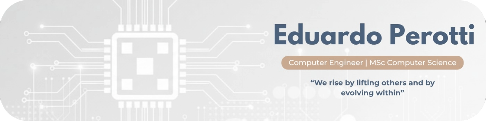

  

# Hi! I'm Eduardo Perotti. 👋

> Computer Engineer at UNIFEI (Federal University of Itajubá) | M.Sc. Candidate in Computer Science and Technology at UNIFEI (Federal University of Itajubá)
> Focus: Computational Mathematics | Research Area: Ontology

🎯 **Computer Engineer** with 3+ years of experience developing scalable software solutions and conversational interfaces. I combine strong technical expertise in **C# (.NET)**, **Node.js**, and **Cloud Architecture** with a solid academic background in **Computational Mathematics and Ontology**. 

My focus is on bridging the gap between complex engineering challenges and business needs, integrating high-level software development with robust infrastructure.

---

### Connect with me

 
  
<!--     -->
<!--  	  -->
<!--   -->
  
   

##

#### 💻 Languages

##

  
:zap: 📊 GitHub Stats

  
  

##

  
🚀 Impact & Achievements

   

  - **Internal Promotion at Blip (Unicorn):** Recognized for technical excellence and delivering critical integrations for global clients.
  - **ALM & DevOps Orchestration:** Managed Application Lifecycle Management using **Azure DevOps**, implementing CI/CD pipelines and enforcing quality with **SonarQube**.
  - **Award-Winning Research:** **Best Paper Award (Ontobras 2025)** for innovation in Ontology Engineering, applying academic rigor to real-world problems.
  - **Technical Standardization:** Established documentation and knowledge bases, reducing onboarding time for international clients.
  - **Full SDLC Management:** Autonomous delivery of high-performance web and chatbot solutions for freelance and enterprise projects.

##

  
🧠 Soft Skills & Leadership

   

  - **Complex Problem Solving** & **Technical Leadership**
  - **Multilingual Communication:** Portuguese (Native), English (Advanced), Spanish (Intermediate), and Japanese (Basic).
  - **R&D & Innovation:** Bridging the gap between academia and industry.
  - **Cross-Functional Collaboration** & **Knowledge Transfer**.

